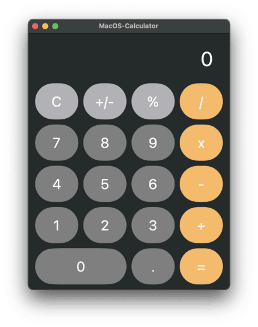

# MacOS-Calculator 🎛️

**MacOS-Calculator** is my attempt to clone Apple's macOS calc. The app utilizes SwiftUI technologies, offering a clean and functional design for basic arithmetic operations.

## ✨ Features

- **Basic arithmetic operations**: addition, subtraction, multiplication, division.
- **Functional buttons**: clear, toggle sign, percentage.
- **Sleek UI** with a "frosted glass" effect that matches macOS design guidelines.
- **Keyboard input support**, making it easy to use with the keyboard as well.

## 🚀 How to Run

1. **Clone the repository:**
   To get started, clone this repository to your local machine:

   ```bash
   git clone https://github.com/Guliveer/MacOS-Calculator.git
   ```

2. **Set up the project:**
   Ensure that you have Xcode installed, along with Swift development tools. Open the project in Xcode.

3. **Run the app:**
   Once the project is open in Xcode, press `Cmd + R` to build and run the app on the simulator or a real device.

   ### You can also download by clicking [here](https://github.com/Guliveer/MacOS-Calculator/releases/latest/download/macos-calc-clone.zip) or through the releases section.

## 👁️ Take a quick look

|                     This                      |                          Apple's                          |
| :-------------------------------------------: | :-------------------------------------------------------: |
|  |  |

See the calculator in action! The "frosted glass" effect gives it a clean and polished look, while the button layout ensures smooth interaction.

## 🖥️ Technologies

- **Swift** and **SwiftUI**: Using Apple's modern programming language and UI framework, I've tried to replicate the native macOS calculator's functionality, design, and user experience. All that while keeping the codebase clean and maintainable.

## ⚙️ Future Features

- **Expanded functionality**: Adding more advanced mathematical operations such as square roots, powers, and logarithms.
- **Dark mode**: Support for system-wide dark/light mode preferences.
- **Customization options**: Ability to personalize the calculator's appearance.
